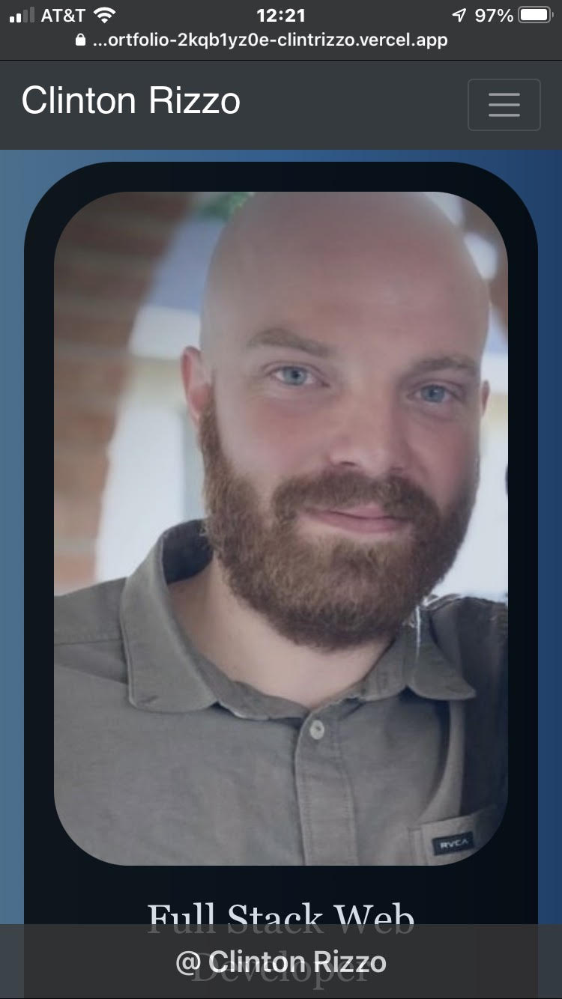
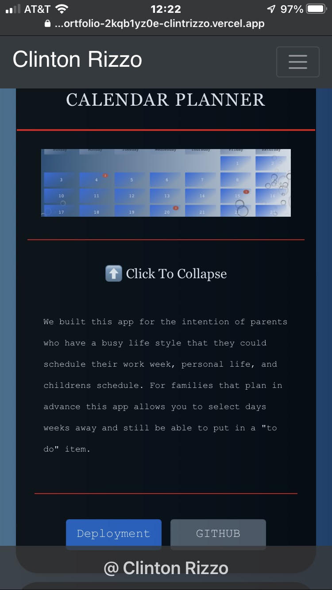

# React Portfolio
    
#Table of Contents
    
  - [React Portfolio](#react-portfolio)
  - [Description:](#description)
  - [Installation:](#installation)
  - [Packages:](#packages)
  - [Testing:](#testing)
  - [Deployed site:](#deployed-site)
  - [Contributers:](#contributers)
  - [Images](#videos)
  - [My-info:](#my-info)
    
## Description:

This portfolio was created for myself to show to potential employeers when applying for future jobs. I implemented many things that I haven't done before. Most recently for this project I brought in cypress and added automation for each pull request to run before completing the merge. I also used new libraries that I hadn't used before as well. This project has been updated from a multiple page portfolio to a single page portfolio. New additions were updating the card section that before was off centered now equal lengths on all screen sizes. I also included a dropdown section for the cards to show little details of each project with a deployment button and a link to the repository. 

## Installation:
npx create-react-app "my-app"

## Packages:
1. react router (npm install --save react-router)
2. react MDL (npm install --save react-mdl)
3. react-bootstrap (npm install react-bootstrap bootstrap@4.6.0)
4. react-router-dom (npm install --save react-router-dom)
5. emailjs-com (npm install emailjs-com --save)
6. react-scroll (npm install react-scroll)

## Testing:
Used cypress for my e2e testing. Mostly added this for practice but also to add more checks to the pull requests. I added three different test specs. Landing page, projects, and projects functionality. 
# deployed Site:
[Portfolio](https://react-portfolio-448d6afjt-clintrizzo.vercel.app/)
    
## Contributers:
Clinton Rizzo
    
## Images
- images from mobile device

## My-info:

For additional information or questions please reach out to my email: clint.rizzo92@gmail.com
