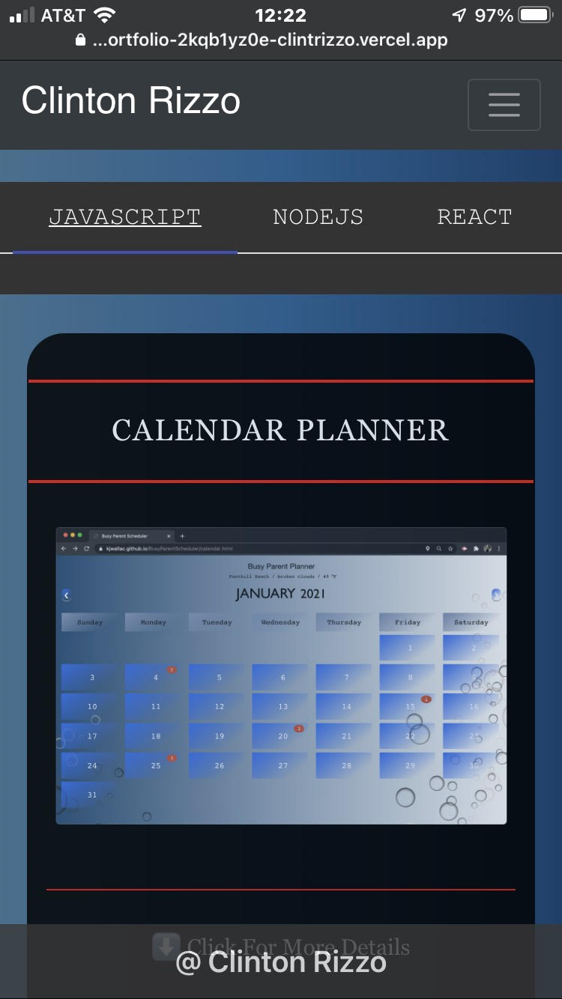

# React Portfolio
    
#Table of Contents
    
- [React Portfolio](#react-portfolio)
  - [Description:](#description)
  - [Installation:](#installation)
  - [Packages:](#packages)
  - [Deployed site:](#deployed-site)
  - [Contributers:](#contributers)
  - [Images](#videos)
  - [My-info:](#my-info)
    
## Description:

This portfolio was created for myself to show to potential employeers as well as a way for me to practice react. This portfolio showcases
my resume, projects I have worked on throughout the last six months, and a functioning contact page. The contact page was created using [email-js](https://www.emailjs.com/docs/examples/reactjs/). 

## Installation:
npx create-react-app "my-app"

## Packages:
1. react router (npm install --save react-router)
2. react MDL (npm install --save react-mdl)
3. react-bootstrap (npm install react-bootstrap bootstrap@4.6.0)
4. react-router-dom (npm install --save react-router-dom)
5. emailjs-com (npm install emailjs-com --save)

# deployed Site:
[Portfolio](https://clintrizzoportfolio.herokuapp.com/)
    
## Contributers:
Clinton Rizzo
    
## Images
- images from mobile device

## My-info:

For additional information or questions please reach out to my email: clint.rizzo92@gmail.com
